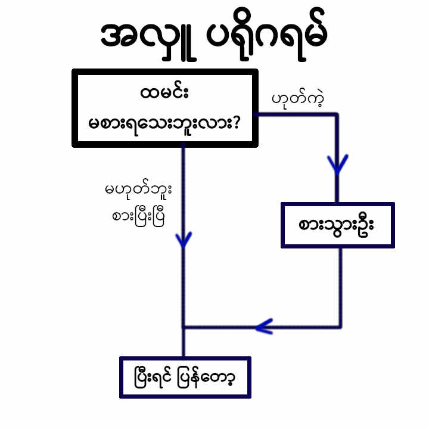

### Conditions

#### IF Statement



> Condition Statements တွေကို [Comparison operators](./operators.md#comparison-operators) တွေနဲ့ တွဲသုံးလေ့ရှိတယ်

##### Example 1 (if)
```python
a = 5
b = 5
c = 10

if a==b:
	print('a and b are same')
	
if a==c:
	print('a and c are same')
```

###### Output:
```
a and b are same
```

##### Example 2 (if ... else)
```python
a = 5
b = 5
c = 10

if a==b:
	print('a and b are same')
else:
	print('a and b are not same')

if a==c:
	print('a and c are same')
else:
	print('a and c are not same')
```

###### Output:
```
a and b are same
a and c are not same
```

##### Example 3 (if ... elif ... else)
```python
num = 1

if num > 0:
	print('Positive')
elif num < 0:
	print('Negative')
else:
	print('Zero')
```

###### Output:
```
Positive
```

##### Example 4 (sample program)
```python
num = int(input('Enter a number: '))

if num > 0:
	print('Positive')
elif num < 0:
	print('Negative')
else:
	print('Zero')
```

###### Output 1:
```
Enter a number: 10
Positive
```
###### Output 2:
```
Enter a number: -2
Negative
```
###### Output 3:
```
Enter a number: 0
Zero
```

<br>

##### Example 5 (Even? or Odd?)
```python
num = int(input('Enter a number: '))

if num%2 == 0:
	print('Even')
else:
	print('Odd')
```
###### Output 1:
```
Enter a number: 3
Odd
```
###### Output 2:
```
Enter a number: 4
Even
```

[Next (Loops)](./loops.md)