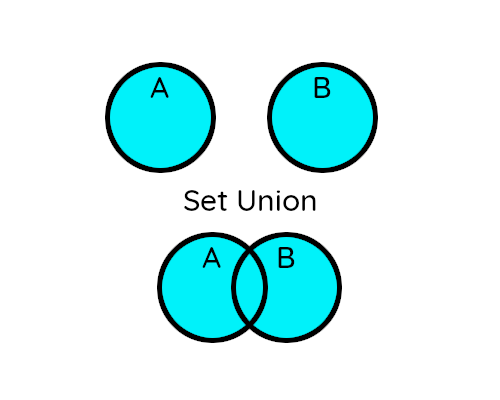
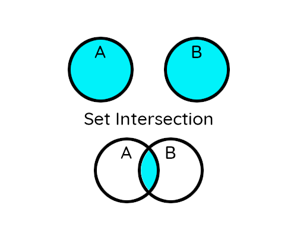
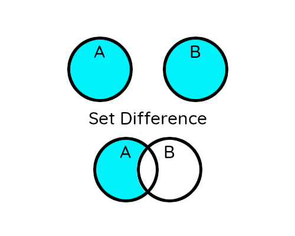

### Set

ထည့်လိုက်တဲ့ items တွေက

* unindex ဖြစ်ပါတယ်။ (list, tuple တို့လို index(အခန်း) နဲ့ ထုတ်လို့ မရပါ)
* unorder ဖြစ်ပါတယ်။ (items တွေက အစဥ်လိုက်ဝင်သွားတာမဟုတ်ပါဘူး။)
* Unique value ဖြစ်ရပါတယ်။ (တူနေတဲ့ items တွေကို တစ်ခုတည်းယူပါတယ်)

#### Declaration

##### Example 1
```python
myset = {"red","green","blue"}
print(myset)
```
###### Output:
```
{'red', 'green', 'blue'}
```

##### Example 2
```python
mylist = ['red','green','blue']
myset = set(mylist)
print(myset)
```
###### Output:
```
{'green', 'red', 'blue'}
```

> List, Tuple နဲ့ မတူတဲ့ နောက်တစ်ချက်က Set ကို empty set ဆောက်တဲ့အခါမှာ ```myset = {}``` ဆိုရင် ```error``` တက်ပါတယ်

> ```myset = set()``` လို့ဆောက်ရပါတယ်

##### Example 3
```python
myset = set()
myset.add(40)
myset.add(99)
print(myset)
```
###### Output:
```
{40, 99}
```

> Set မှာ item တွေထည့်ပြီးရင် change လို့ မရတော့ပါဘူး

##### Example 4 (access items)
```python
colorSet = {'red','green','blue','black','white'}

for color in colorSet:
	print('This is',color)
```
###### Output:
```
This is white
This is green
This is red
This is black
This is blue
```

> တခြားသော Iterable items တွေကို အကုန်ထည့်ချင်တဲ့ အခါမှာ ```set.update(iterable)``` ကိုသုံးပါတယ်။

##### Example 5 (update)
```python
abc = {'a','b','c'}
xyz = ['x','y','z']
abc.update(xyz)

print(abc)
```
###### Output:
```
{'c', 'a', 'y', 'b', 'x', 'z'}
```

##### Example 6 (removing)
```python
alphabet = set("abcdefg")
print("Original set:")
print(alphabet)
print()

alphabet.remove('e')
print("Removed 'e':")
print(alphabet)
print()

alphabet.discard('a')
print("Discarded 'a':")
print(alphabet)
print()

print("Popped unknown item '",alphabet.pop(),"':")
print(alphabet)
print()

alphabet.clear()
print("Cleared:")
print(alphabet)
print()

del alphabet
print("Deleted variable alphabet:")
print(alphabet)
#error will occur
print()
```
###### Output:
```
Original set:
{'g', 'c', 'a', 'f', 'd', 'b', 'e'}

Removed 'e':
{'g', 'c', 'a', 'f', 'd', 'b'}

Discarded 'a':
{'g', 'c', 'f', 'd', 'b'}

Popped unknown item ' g ':
{'c', 'f', 'd', 'b'}

Cleared:
set()

Deleted variable alphabet:
Traceback (most recent call last):
  File "test.py", line 27, in <module>
    print(alphabet)
NameError: name 'alphabet' is not defined
```

> ```set.remove()``` နဲ့ ```set.discard()``` အဓိက ကွာခြားတာကတော့ remove က ဖျက်လိုတဲ့ item က set ထဲမှာမရှိရင် error တက်ပြီး discard ကတော့ မတက်ပါဘူး

> ```set.pop()``` က list, tuple တို့နဲ့ မတူတာက set သည် unindex ဖြစ်တဲ့ အတွက် ဖျက်လိုတဲ့ index ကို ရွေးပြီး ဖျက်လို့ မရဘူး။ set ထဲမှာ ရှိနေတဲ့ ထိပ်ဆုံးအခန်းကို ဖျက်လိုက်တာဖြစ်တယ် (ဒါကြောင့် သူ ဘယ်နားကို ဖျက်လိုက်တယ်ဆိုတာ မသိရဘူး)

> ```set.clear()``` နဲ့ ```del set``` ကွာခြားတာကတော့ clear က set ထဲမှာရှိတဲ့ items တွေအားလုံးကိုပဲ ဖျက်တာ၊ del ကတော့ အဲဒီ variable တစ်ခုလုံးကို ဖျက်လိုက်တာ

<hr>
<br>

**Set ကို အဓိကသုံးလို့ကောင်းတဲ့အပိုင်းလာပါပြီ**

#### Set Union

> Union ဆိုတာ set နှစ်ခုကို ရောလိုက်တာပါ



##### Example 7 (union)

```python
setA = {1,2,3,4,5}
setB = {1,3,5,7,9}

#Union using set.union()
print(setA.union(setB))

#Union using '|' operator
print(setA | setB)
```
###### Output:
```
{1, 2, 3, 4, 5, 7, 9}
{1, 2, 3, 4, 5, 7, 9}
```
#### Set Intersection

> Intersection ဆိုတာ set နှစ်ခုထဲမှာ ဘုံတူနေတဲ့ Value တွေကို ဆွဲထုတ်တာပါ



##### Example 8 (intersection)

```python
setA = {1,2,3,4,5}
setB = {1,3,5,7,9}

#Intersection using set.intersection()
print(setA.intersection(setB))

#Intersection using '&' operator
print(setA & setB)
```
###### Output:
```
{1, 3, 5}
{1, 3, 5}
```

#### Set Difference

> Set A ထဲမှာပါနေတဲ့ Set B ထဲက Value တွေကို နှုတ်လိုက်တာ။ တနည်းပြောရရင် A ထဲက B ကို နှုတ်တာပေါ့



##### Example 8 (difference)

```python
setA = {1,2,3,4,5}
setB = {1,3,5,7,9}

#using set.difference()
print(setA.difference(setB))

#using '-' operator
print(setA - setB)
```
###### Output:
```
{2, 4}
{2, 4}
```

#### Set Symmetric Difference

> Symmetric Difference ဆိုတာ set နှစ်ခုထဲမှာ ဘုံတူနေတဲ့ Value တွေကို ဖယ်လိုက်တာပါ။ (intersection နဲ့ ဆန့်ကျင်ဖက်)(Exclusive values)


##### Example 8 (symmetric_difference)

```python
setA = {1,2,3,4,5}
setB = {1,3,5,7,9}

#using set.symmetric_difference()
print(setA.symmetric_difference(setB))

#using '^' operator
print(setA ^ setB)
```
###### Output:
```
{2, 4, 7, 9}
{2, 4, 7, 9}
```

### Python Set Methods

| Method | Description |
| --- | --- |
| add() | Adds an element to the set |
| clear() | Removes all elements from the set |
| copy() | Returns a copy of the set |
| difference() | Returns the difference of two or more sets as a new set |
| difference_update() | Removes all elements of another set from this set |
| discard() | Removes an element from the set if it is a member. (Do nothing if the element is not in set) |
| intersection() | Returns the intersection of two sets as a new set |
| intersection_update() | Updates the set with the intersection of itself and another |
| isdisjoint() | Returns True if two sets have a null intersection |
| issubset() | Returns True if another set contains this set |
| issuperset() | Returns True if this set contains another set |
| pop() | Removes and returns an arbitrary set element. Raises KeyError if the set is empty |
| remove() | Removes an element from the set. If the element is not a member, raises a KeyError |
| symmetric_difference() | Returns the symmetric difference of two sets as a new set |
| symmetric_difference_update() | Updates a set with the symmetric difference of itself and another |
| union() | Returns the union of sets in a new set |
| update() | Updates the set with the union of itself and others |
